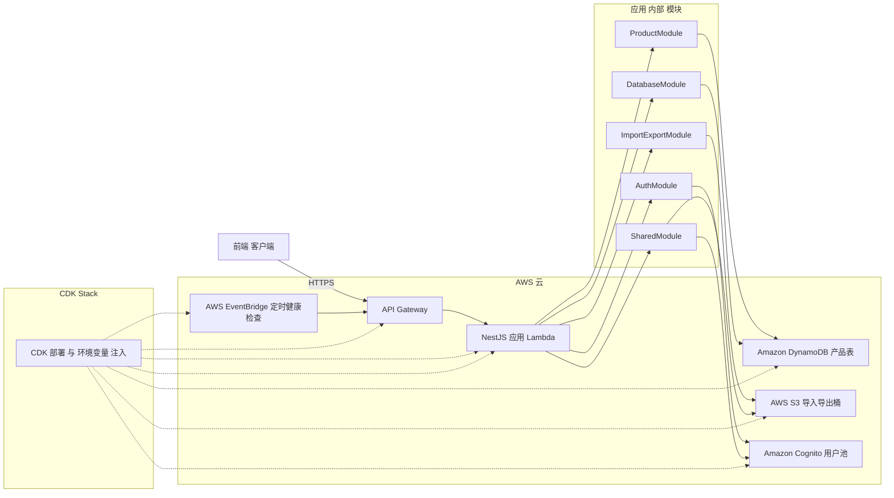

# 项目模板使用指南（NestJS + AWS CDK）

本指南面向使用本模板快速搭建「NestJS 后端应用 + AWS CDK 基础设施」的开发者，涵盖本地开发与多环境部署的常见流程与注意事项。

- 技术栈：NestJS、TypeScript、AWS CDK、API Gateway + Lambda、DynamoDB、S3、Cognito
- 仓库结构：Yarn Workspaces Monorepo（workspaces：`backend`、`llm-lambda`；以及 `infrastructure` CDK 工程）

## 项目介绍（Serverless 架构）

本模板采用 AWS CDK 以基础设施即代码（Infrastructure as Code, IaC）的方式，将后端应用部署到 AWS Lambda，并通过 API Gateway 对外提供服务，形成一套端到端的 Serverless 方案。相较自管服务器，该架构具有以下优势：

- 降本：按调用计费（Pay-per-request），闲时成本极低，显著降低总体部署与运行成本。
- 稳定扩展：Lambda 自动弹性伸缩，无需预置实例即可应对访问量增长，在高峰期也能保持稳定与高可用，几乎实现“零运维扩容成本”。
- 敏捷与可维护：通过 CDK 声明式管理资源，版本化、可回滚、可重复部署，适合多环境与团队协作。

## 功能总览（开箱即用）

- 通用导入/导出模块（Import/Export，基于 S3）
  - 生成导入用预签名上传 URL；服务端从 S3 拉取并解析；导出数据上传至 S3 并返回短时效下载链接。
  - 已在 `Customers`、`Products` 模块中提供示例与对接接口。
- 常规 CRUD
  - DTO 校验、分页查询、Swagger 文档与角色权限控制（Role）。
- CDK 保持温（Keep-warm）
  - 通过 EventBridge 周期性调用健康检查接口，降低 Lambda 冷启动概率。
- 基础用户体系
  - 注册、邮箱验证码验证、登录、个人资料、修改密码；Cognito 集成 + JWT 保护业务 API。
- DynamoDB 集成
  - 按需计费（Pay-per-request）表与常用 GSI；表名、区域等通过 CDK 输出注入环境变量。

### 架构总览（Mermaid）



说明要点：

- 路由与运行时：通过 API Gateway 统一代理 HTTP 请求到单一 Lambda，NestJS 在 `main.ts`（本地）与 `lambda.ts`（部署）中完成全局前缀、验证管道、异常过滤器与拦截器的注册。
- 鉴权（Cognito）：
  - 使用 `aws-jwt-verify` 在全局 `CognitoJwtAuthGuard` 中校验 Access Token，并将用户/组/角色注入 `request.user`。
  - CDK 同步创建 User Pool、Client 与三种组（`user`、`admin`、`super_admin`），与 `@Roles()` 装饰器/`RolesGuard` 对齐。
- 存储（DynamoDB + S3）：
  - 产品数据落在 DynamoDB `products` 表（含 `ProductTypeIndex`、`StatusIndex` 等 GSI）；
  - 导入/导出文件使用 S3 `import-export` 专用桶，Import/Export 模块提供预签名上传、服务端读取与短时效下载能力。
- 配置注入：
  - CDK 在创建 Lambda 时注入 `API_PREFIX`、`COGNITO_*`、`DYNAMODB_*`、`S3_*` 等环境变量；部署日志输出 `EnvFileContent` 供本地 `.env`、`backend/.env` 同步。
- 稳定性：EventBridge 每 5 分钟调用健康检查路由减少冷启动；生产禁用 Swagger，可按需启用预置并发。

## 在线示例

- 链接：https://main.d3919bjo2q9c5.amplifyapp.com/
- 测试账户：`linuo`
- 测试密码：`Ur8Djfm6vtuf9Lc!`
-

## 目录结构

```
├── backend/                  # NestJS 应用（源码、构建、测试）
│   └── src/
│       ├── modules/          # 业务模块（user/customer/product/...）
│       ├── auth/             # 鉴权（Cognito + JWT）
│       ├── common/           # 通用组件（拦截器/管道/过滤器）
│       ├── shared/           # 工具与跨模块能力
│       ├── config/           # 配置（按环境）
│       └── database/         # 数据库（DynamoDB）
├── llm-lambda/               # 额外 Lambda 工作区（LLM 示例/集成）
├── infrastructure/           # AWS CDK 工程（部署、对比、销毁）
├── scripts/                  # 构建与部署脚本（含 Lambda 打包）
├── docs/                     # 文档与说明
├── dist/                     # 构建产物（自动生成）
├── lambda-package/           # Lambda 打包产物（由脚本生成）
└── package.json              # 根工作区脚本（统一入口）
```

更多背景参考：`README.md`、`docs/ENVIRONMENT_SETUP.md`、`docs/CDK_OUTPUT_EXAMPLE.md`。

---

## 如何开发（本地）

### 1. 环境准备

- Node.js 20+
- Yarn（推荐）或 npm
- AWS CLI v2（已配置凭证：`aws configure`）
- AWS CDK v2：`npm i -g aws-cdk`

### 2. 安装依赖

```bash
# 在仓库根目录执行（推荐 Yarn）
yarn
# 或使用 npm（npm 7+ 支持 workspaces）
npm install
```

### 3. 配置环境变量（首次需先部署以获取 CDK 输出）

```bash
# 1) 准备本地 env 文件
cp .env.example .env
yes | cp .env backend/.env  # 或手动创建 backend/.env

# 2) 首次部署开发环境（生成 AWS 资源与 Stack Outputs）
npm run deploy:dev  # 或 yarn deploy:dev

# 3) 部署完成后，直接在终端部署日志中复制名为 "EnvFileContent" 的输出块
#    将其完整粘贴到根目录 .env 与 backend/.env 中（覆盖同名变量）
#    说明：日志中还会输出 "ApiEndpoint"，可用于快速访问 API 网关地址
#    提示：包括 Cognito、S3、DynamoDB 等关键变量；未填写将导致服务无法正常启动
```

常用变量与示例见 `docs/CDK_OUTPUT_EXAMPLE.md`；请勿将私密信息提交到仓库。

提示：如遇变量名不一致或启动失败，请参考《CDK部署输出示例》文档：`docs/CDK_OUTPUT_EXAMPLE.md`。该文档提供了输出格式与常见变量清单，便于对照排查。但请以当前部署日志中的 `EnvFileContent` 为准（仓库升级后变量名有所调整）。
常见差异示例：

- 旧文档中的 `S3_BUCKET_NAME` 现为 `S3_IMPORT_EXPORT_BUCKET_NAME`
- 旧文档中的 `AWS_REGION` 现以 `APP_AWS_REGION`、`S3_REGION`、`COGNITO_REGION`、`DYNAMODB_REGION` 分项提供
- 旧文档列出了多张表；当前仅需 `DB_TABLE_PRODUCTS`

### 4. 启动开发服务

```bash
# 方式 A：通过根脚本（调用 workspace）
npm run backend:start:dev

# 方式 B：进入应用目录
yarn workspace backend start:dev
# 或
cd backend && npm run start:dev
```

默认运行地址：

- API Base: `http://localhost:3000/api/v1`
- Swagger: `http://localhost:3000/api/v1/docs`（非生产环境自动开启）

### 5. 常用开发脚本

```bash
# 构建应用（仅编译，不打包 Lambda）
npm run backend:build

# 代码质量
npm run lint
npm run format

# 单元测试（在各 workspace 内执行）
npm test
```

说明：根脚本通过 Yarn Workspaces 统一调用各子工程脚本；也可以进入 `backend/` 独立执行。

### 6. 代码规范与模块组织

- 风格：ESLint + Prettier（2 空格缩进、singleQuote、semi、trailingComma）
- 命名：文件 kebab-case；类/接口 PascalCase；变量/函数 camelCase
- 路径别名：优先使用 `@/` 导入（参见 `backend/tsconfig.json`）
- 模块结构：`backend/src/modules/<feature>/{*.module,*.service,*.controller}.ts`
- 提交规范：Conventional Commits，例如 `feat(user): add profile API`

---

## 前端模板

- 仓库地址：[aws-nextjs-amplify-template](https://github.com/lfhwnqe/aws-nextjs-amplify-template)
- 契合性：该前端模板与当前服务端模板的接口返回保持一致；当你完成后端部署并按“EnvFileContent”配置好 `.env` 与 `backend/.env` 后，即可直接进行前后端联调与开发调试。
- API Base 配置：使用部署日志中的 `ApiEndpoint` 与 `.env` 中的 `API_PREFIX` 组合，例如：`https://<api-id>.execute-api.<region>.amazonaws.com/dev/api/v1`。
- CORS：当前后端 CORS 默认较宽松（`*`），生产环境请在 CDK 或应用层收紧到可信前端域名。

前端模板的安装与启动方式请参考其仓库 README；通常为安装依赖并启动本地开发服务（如 `npm install && npm run dev`）。

---

## 如何部署不同环境（Dev / Prod）

本模板使用 AWS CDK 管理基础设施，并将 NestJS 构建为 Lambda 函数，通过 API Gateway 对外提供服务。部署前请确保：

- 已完成 AWS CLI 登录：`aws configure`
- 首次在账户/区域使用 CDK 已完成 bootstrap：
  ```bash
  cd infrastructure
  cdk bootstrap
  cd ..
  ```

### 1. 环境与命名约定

- 环境标识：`dev`、`prod`（通过 `--context environment=<env>` 传入）
- Stack 命名：默认使用 `linuo-aws-template-<env>`；可通过 `--context stackName=<name>` 覆盖
- 项目名前缀：可用 `PROJECT_NAME` 环境变量影响资源与 Stack 前缀（默认 `linuo-aws-template`）

参考（见 `infrastructure/bin/app.ts`）：

- 未显式传入 `stackName` 时，Stack 名为 `${PROJECT_NAME}-${environment}`
- 传入 `stackName` 时，会优先使用它，并尝试从中派生 `projectName`

### 2. 打包 Lambda 并部署

推荐使用根脚本（已封装打包与 CDK 部署流程）：

```bash
# Development
yarn deploy:dev
# 或
npm run deploy:dev

# Production
yarn deploy:prod
# 或
npm run deploy:prod
```

上述脚本等价于：

1. 构建 Lambda 包（`backend:build:lambda` → `scripts/build-lambda.sh` 产物到 `lambda-package/`）
2. 执行 CDK 部署（`infrastructure/` 内 `cdk deploy`），并传入 `--context environment=dev|prod` 和默认 StackName

如需仅对比变更或仅部署基础设施：

```bash
# 仅对比
yarn cdk:diff:dev
yarn cdk:diff:prod

# 仅部署
yarn cdk:deploy:dev
yarn cdk:deploy:prod
```

自定义 Stack 名示例：

```bash
# 部署自定义名称（将覆盖默认 linuo-aws-template-<env>）
npm run cdk:deploy:dev -- --context stackName=my-awesome-app-dev
```

### 3. 销毁环境

```bash
# Destroy Dev
yarn destroy:lambda:dev  # 等同 cdk destroy --context environment=dev

# Destroy Prod
yarn destroy:lambda:prod
```

也可使用：`yarn cdk:destroy:dev` / `yarn cdk:destroy:prod`。

### 4. 部署后验证

- 在部署日志中查看 `ApiEndpoint` 输出获取 API Gateway URL（或在控制台 Outputs 中查看）
- 访问健康检查：`GET {apiBase}/health`
- 非生产环境可访问 Swagger：`{apiBase}/docs`
- 若启用鉴权，先执行登录流程获取 JWT 并在 Swagger Authorize 中设置

### 5. Lambda 打包策略（要点）

- 入口：`backend/src/lambda.ts`；webpack 配置在 `backend/webpack.lambda.config.js`
- 打包脚本：`scripts/build-lambda.sh`；产物目录：`lambda-package/`
- 依赖策略：尽量将依赖打入 bundle，`swagger-ui-dist` 作为 external 并复制静态资源
- 生产环境默认关闭 Swagger（通过环境变量控制）

如需引入需要“运行时文件存在”的依赖或 Nest 可选子模块（microservices/websockets），请相应调整 webpack 配置与复制脚本。

---

## 导入/导出（S3）使用

通用 Import/Export 模块位于 `backend/src/modules/import-export`，同时在业务模块中演示了端到端流程：

- 获取导入文件的 S3 预签名上传 URL（前端 PUT 上传）：
  - `POST {apiBase}/import-export/imports/presigned-url`
  - 请求体示例：
    ```json
    {
      "fileName": "customers.xlsx",
      "contentType": "application/vnd.openxmlformats-officedocument.spreadsheetml.sheet",
      "type": "customer"
    }
    ```
  - 返回：`{ uploadUrl, key, expiresIn }`
- 从 S3 拉取并导入（服务端读取 key 并解析）：
  - `POST {apiBase}/customers/imports/s3` 或 `POST {apiBase}/products/imports/s3`
  - 请求体：`{ "key": "imports/customers/<uuid>-customers.xlsx" }`
- 直接上传表单文件导入（多部分表单）：
  - `POST {apiBase}/customers/import` 或 `POST {apiBase}/products/import`，字段名 `file`
- 导出 Excel（返回短时效下载 URL）：
  - `GET {apiBase}/customers/export` 或 `GET {apiBase}/products/export`（需要 JWT）

环境变量：

- `S3_IMPORT_EXPORT_BUCKET_NAME`、`S3_REGION` 由 CDK 部署输出注入（见 `docs/CDK_OUTPUT_EXAMPLE.md`）。

生产建议：收紧 CORS、限制可上传的文件类型与大小，并在前后端双重校验。

---

## 鉴权与用户管理（基础能力）

- 注册：`POST {apiBase}/auth/register`
- 邮件验证码验证：`POST {apiBase}/auth/verify-registration`
- 登录：`POST {apiBase}/auth/login`（返回 JWT）
- 个人资料：`GET {apiBase}/auth/profile`（需要 Bearer Token）
- 修改密码：`POST {apiBase}/auth/change-password`（需要 Bearer Token）

后端使用 Cognito 承载用户目录，应用侧使用 JWT 保护业务 API，Swagger 已集成 Authorize 入口。

---

## CDK 保持温（Keep-warm）

- 基础设施中已创建 EventBridge 规则，每 5 分钟调用一次健康检查 `GET /api/v1/health`，以保持函数活跃、降低冷启动概率。
- 若需更低尾延时，可在生产环境考虑配置 Lambda Provisioned Concurrency（需额外费用，默认未开启）。

---

## DynamoDB 集成说明

- 计费模式：PAY_PER_REQUEST；生产环境启用 PITR（按需调整）。
- 示例表：`users`、`customers`、`products`，由 CDK 创建并通过环境变量注入：
  - `DB_TABLE_USERS`、`DB_TABLE_CUSTOMERS`、`DB_TABLE_PRODUCTS`
  - `DYNAMODB_REGION`、`DYNAMODB_TABLE_PREFIX`
- 常用二级索引：如 `EmailIndex`、`PhoneIndex`、`ProductTypeIndex` 等，覆盖常见检索场景。

## 常见问题（排查）

- AWS 凭证缺失：执行 `aws configure` 或导出环境变量 `AWS_ACCESS_KEY_ID` / `AWS_SECRET_ACCESS_KEY`
- 首次部署报 bootstrap：进入 `infrastructure` 执行 `cdk bootstrap`
- 端口占用：修改 `backend/.env` 中 `PORT` 或释放端口（如 `lsof -ti:3000 | xargs kill -9`）
- 生产无 Swagger：预期行为，生产默认禁用文档路由
- 鉴权 401/403：检查 JWT 配置与 Cognito 变量，或使用开放路由验证健康检查

---

## 工作流建议

- 开发：`backend:start:dev` → `lint/format/test` → `backend:build`
- 预检：`cdk:diff:<env>` 确认资源变更
- 部署：`deploy:<env>`（或显式 `cdk:deploy:<env>`）
- 回滚：通过 CloudFormation 控制台回滚至上次成功版本，或在 Git 回退后重新部署

---

## 参考脚本（根 package.json）

- 开发：`backend:start:dev`
- 构建：`backend:build`、`backend:build:lambda`、`build:lambda`
- 测试/质量：`test`、`lint`、`format`
- 基础设施：`cdk:diff:dev|prod`、`cdk:deploy:dev|prod`、`cdk:destroy:dev|prod`
- 一键部署：`deploy:dev|prod`（含 Lambda 打包）

如需扩展 CI/CD，可在流水线中按上述顺序编排命令。

---

如对模板有建议或需求，欢迎在仓库提 Issue 讨论与共建。
